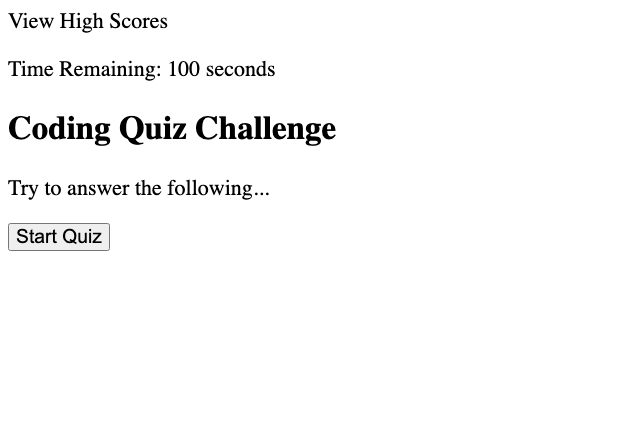

# Code Quiz

## Description

This project involves creating a timed quiz from scratch that incorpates JavaScript.

While I was unable to complete this fully, this assignment helped me understand multiple concepts such as:

-Using event listeners 
-Using JavaScript to dynamically create and edit other variables and properties within my code 
-Using methods to grab nested content 
-Creating timers that start and change based on other events 

## Installation

Open and take the quiz at the following link: 

[Code Quiz](https://shbunch.github.io/password-generator/)

 

## Usage

Simply click the 'Start Quiz' button to begin the quiz

 

## Credits

SMU Coding Boot Camp

GIVEN I am taking a code quiz

WHEN I click the start button
THEN a timer starts and I am presented with a question

WHEN I answer a question
THEN I am presented with another question

WHEN I answer a question incorrectly
THEN time is subtracted from the clock

WHEN all questions are answered or the timer reaches 0
THEN the game is over

WHEN the game is over
THEN I can save my initials and score